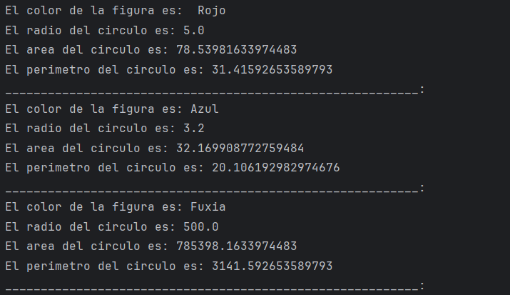
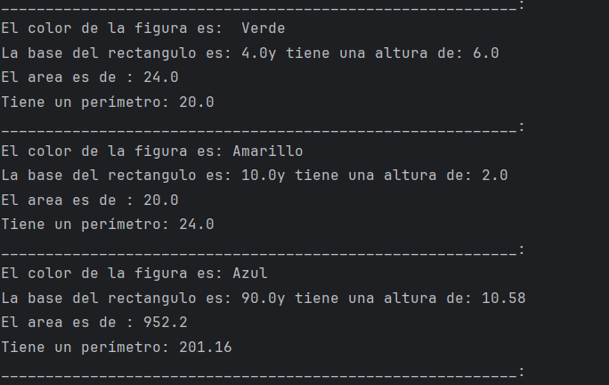
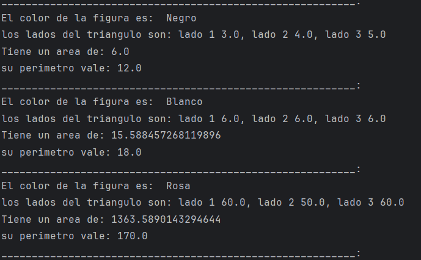

# TALLER ArrayList 

Objetivo

 El objetico del taller era aplicar conceptos de ArrayList  para almacenar y manipular objetos.

# Desarrollo

El proyecto se desarolo en lenguaje java en el editor de codigo intellij 

con las clases figura(esta seria la calse base para todas las figuras), clase circulo, clase trianmgulo y clase rectangulo

para esto todas tenian en comun un dato base que era el color
para eso se realizo un constructor para poder asignar el color a todas ya que es un dato que vi que no seria variable si no fijo
por que todos los iban a cumplir
apoyandome en videos y materiales de apoyo tambien en la IA :) vi que estaban hablando 
de un metodo llamado "abstract", segun la informacion este metodo sirve para que las clases que se herede de ella este obligada
a porporcionar una implementacion concreta para esos metodos ya que su proposito principal es definir una estructura comun 
para las calses que heredaran de ella, vi que lo mejor es usarla con el modificador public para que pueda ser accesible desde cualquier parte del codigo

se creo un metodo para poder mostrar la informacion que todos llevaran que en este caso es el color ya que como dije vi que era un valor fijo

cree las clases para circulo, triangulo y rectangulo individualmente asiganandole el atributo del radio.
le aplique un constructor para poder inicializar el radio y llamar al constructor del color

mediante  @Override implemente los metodos para calcular el area y el perimetro utilizando las formulas
(pi x radio x radio)
(2 x pi x radio)

todo esto acompañado de un @Override para poder imprimir los resultados
y asi con las dos figuras siguentes

# IMPLEMENTACION DE ArrayList 

el ejercicio estaba enfocado en implementar el ArrayList en este ejerccio se demostro que permite almacenar de forma dinamica un conjunto 
de objetos diferentes como lo son las figuras dentro de una sola lista, este ofrece la aplicios de metodos como el add() y for-each para poder recorrer sus elementos
con eso se facilita la manipulacion de multiples datos en memoria y asi poder listar e imprimir sus propiedades sin tener que definir previamente un tamaño fijo 

## RESULTADOS DEL CODIGO
### *RESULTADO DE CODIGO CIRCULO*:

### *RESULTADO DE CODIGO RECTANGULO*:

### *RESULTADO DE CODIGO TRIANGULO*:

