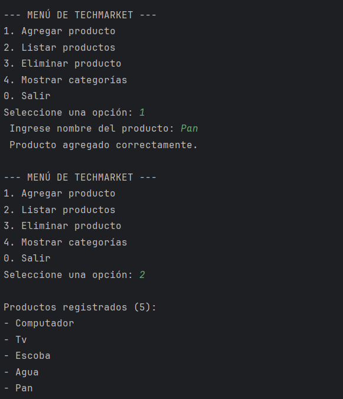
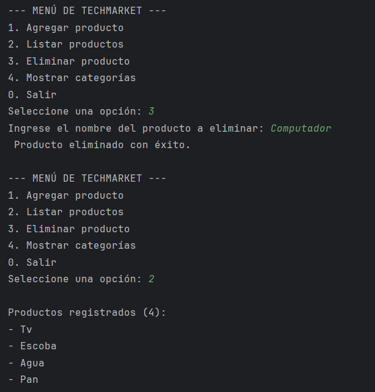
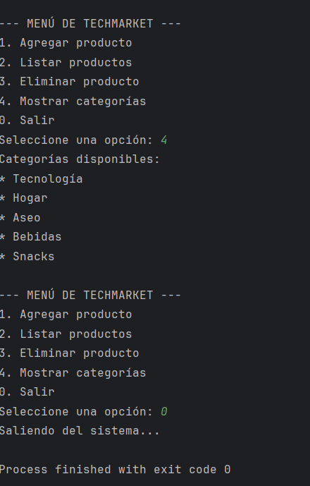

> # Taller Práctico – Estructura de Datos
## SEGUNDA PARTE DEL PARCIAL
### PROPOSITO DEL TALLER
Desarrollar un programa funcional que combine el uso de ArrayList, vectores (arrays) y
estructuras de repetición (ciclos) para gestionar información de manera estructurada,
aplicando los principios básicos de las estructuras de datos

### Situación planteada
La tienda TechMarket requiere un sistema sencillo que permita gestionar productos.
El sistema debe permitir agregar, listar y eliminar productos, además de mostrar
categorías predefinidas

### Requerimientos del sistema
Menú principal:
- 1 Agregar producto 
- 2 Listar productos
- 3 Eliminar producto
- 4 Mostrar categorías
- 0 Salir

2. Estructuras a implementar:
   ArrayList: para almacenar los productos ingresados.
   Vector: con categorías fijas (ejemplo:
   {"Tecnología", "Hogar", "Aseo", "Bebidas", "Snacks"}
   ).
   Ciclos: para recorrer estructuras y mostrar resultados.

3. Validaciones mínimas:
   No permitir campos vacíos.
   Validar existencia antes de eliminar.
   Controlar opciones inválidas del menú.

> # DESARROLO DEL TALLER

Se tomo como base el codigo que se anexa en el taller, se agrego la implementacion de mas elementos para poder cumplir con los requerimientos que pedia el ejercicio.

ya el ejercicio esta muy completo, el codigo empieza con la importacion de dos librerias que son la de arraylist y scanner, arraylista para crear una tabla dinamica de elementos para poder manipular los datos
scanner para leer las entradas del usuario desde la consola
declaramos publica la clase que contiene el programa, empezamos agregado el main para ejecutar el programa 
creamos el objeto scanner para leer los datos y lo implementamos dentro de las opciones y textos como sc.

creamos un arraylist de tipo string llamada productos para guardar los nombres de los productos agregados durante la ejecucion 
declaramos e inicializamos un array de string con categorias fijas ya que estos no van a fluctuar
creamos una variable int para almacenar la opcion del menu que el usuario va a elegir

### IMPLEMENTACION DE VALIDACION DE ENTRADA DEL MENU

creamos un while y se implemento hasNextInt para verificar que la siguiente entrada se un entero si el usuario no escribe un texto este while que nextInt haga una excepcion para eso tambien nos apoyamos con sc.next para que descarte
la entrada invalida y solicite una nueva opcion 

con el switch se estructura el control para ejecutar las acciones correspondientes 

para la opcion 1

imprime el mensaje para pedir el nombre del producto 

pasa por una validacion tipo iif (!p.isEmpty()) esto no permite que hallan cadenas vacias, si pasa la validacion se agrega a la arraylist e imprime un mensaje de extito o error

para la opcion 2

que es la opcion de productos registrados usamos el size del array list para que muestre el numero de productos registrados 
agragamos un if para que si no halla nada imprima, y si hay por medio del else recorra la lista con un for y busque en los string productos e imprima lo que ya hay registrados

opcion 3 

para la eliminacion de un producto empezamos implementando eliminar.isEmpty esto avisa que no puede estar vacio el nombre
por medio de un else if comprobamos la existencia  en la lista, en caso de que si exista lo elimina e imprime mensaje exitoso de lo contrario imprimer un mensaje de error 

opcion 4

imprime las categorias ya predeterminadeas en las categorias

opcion 0

imprime salida y termina en un do-while 

casi finalizando el codigo terminamos con el cilclo while (opcion !=0) esta condicion garantiza la repeticion del menu y el bucle continuara hasta que se elija la opcion 0

cerramos el scanner con sc.close 

> # EVIDENCIAS
> 
> 
> 
>
> 
> 
> 
> 
> 
> 
> 

