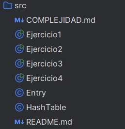

>Taller: Implementación Básica de una Tabla Hash
> Descripción general

#### Este proyecto implementa una tabla hash genérica <K,V> en Java, con manejo de colisiones mediante encadenamiento.
#### Su propósito es comprender cómo funcionan internamente las tablas hash, cómo se almacenan las claves y valores, y cómo afectan las colisiones al rendimiento.

> Estructura del proyecto

>Resumen de ejercicios
## Ejercicio 1 — Diccionario simple

Permite guardar usuarios y sus roles, con operaciones para agregar, consultar y eliminar.
👉 Aprendizaje: uso básico de la tabla hash con cadenas de texto.

🟣 Ejercicio 2 — Contador de palabras

Cuenta cuántas veces aparece cada palabra en un texto.
👉 Aprendizaje: actualización de valores y control de claves repetidas.

🟠 Ejercicio 3 — Colisiones controladas

Inserta claves diferentes que generan el mismo índice para observar cómo se enlazan dentro del mismo bucket.
👉 Aprendizaje: funcionamiento del encadenamiento y del campo next en la clase Entry.

🔵 Ejercicio 4 — Prueba de tamaño

Inserta una cantidad grande de elementos y muestra cuántos guarda realmente la tabla.
👉 Aprendizaje: medición de capacidad y comprensión del tamaño lógico (size).

📊 Análisis de complejidad
Operación	Promedio	Peor caso
Insertar	O(1)	O(n)
Buscar	O(1)	O(n)
Eliminar	O(1)	O(n)

En palabras simples:

En promedio, la tabla hash es muy rápida, porque accede directamente al dato sin recorrer todos los elementos.

Si muchas claves generan el mismo índice (colisiones), el tiempo puede aumentar hasta O(n).

Para mantener la eficiencia, se debe elegir una capacidad adecuada y una función hash bien distribuida.

🧾 Resultados observados

Las operaciones básicas funcionan correctamente (insertar, buscar, eliminar).

Las colisiones se manejan de forma correcta con listas enlazadas.

El tamaño (size) refleja con precisión los elementos almacenados.

En los ejercicios se observó que:

Con pocas colisiones, las operaciones son casi instantáneas.

Con muchas colisiones, el tiempo aumenta levemente, comprobando la teoría de complejidad.

✅ Conclusiones

La tabla hash ofrece eficiencia y simplicidad para almacenar pares clave–valor.

Las colisiones no se pueden evitar, pero sí se pueden controlar mediante encadenamiento.

Este ejercicio demuestra de forma práctica cómo una estructura de datos puede mantener un acceso rápido incluso con muchos elementos.