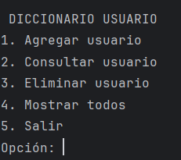
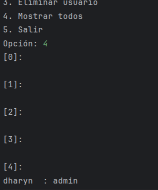
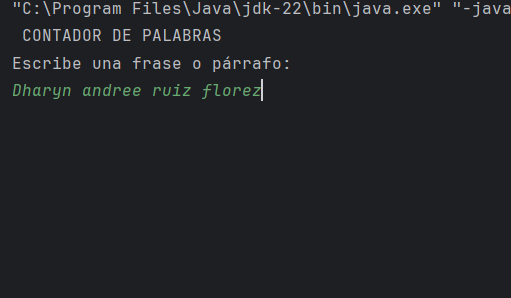
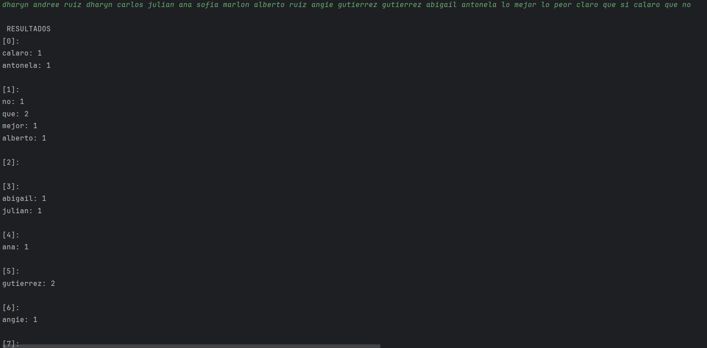
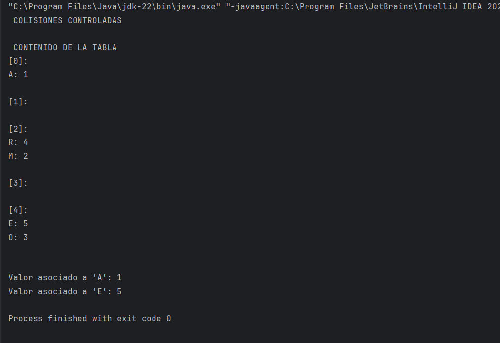
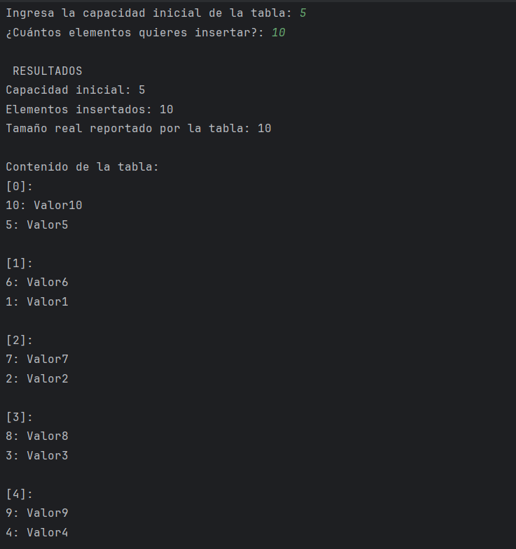

> # Taller: Implementación Básica de una Tabla Hash
> ### Descripción general

#### Este proyecto implementa una tabla hash genérica <K,V> en Java, con manejo de colisiones mediante encadenamiento.
#### Su propósito es comprender cómo funcionan internamente las tablas hash, cómo se almacenan las claves y valores, y cómo afectan las colisiones al rendimiento.

> Estructura del proyecto

>Resumen de ejercicios
## Ejercicio 1 — Diccionario simple
En este ejercicio  se creo un diccionario simple con  usuario → rol con menú de agregar, consultar y eliminar.
Implementado lo que es el scanner y el do-while creamos unn menu con casos para cada funcion que elija el usuario en este ejercicio
declaramos caso 1 para ingresar usuarios y roles, caso 2 consultar caso 3 eliminar y caso 4 imprimir loq ue hay guardado
se aplico lo que se pidio en el ejercio dando como resultado la siguiente tabla de complejidad

| Bloque del código       | Tipo de operación      | Complejidad temporal  | Complejidad espacial |
| ----------------------- | ---------------------- | --------------------- | -------------------- |
| Lectura con Scanner     | Entrada del usuario    | O(1)                  | O(1)                 |
| Menú principal (bucle do-while) | Repite operaciones     | O(m) (según acciones) | O(n)                 |
| HashTable.put()         | Inserción              | O(1)                  | O(1)                 |
| HashTable.get()         | Búsqueda               | O(1)                  | O(1)                 |
| HashTable.remove()      | Eliminación            | O(1)                  | O(1)                 |
| imprimirTabla()         | Recorrer toda la tabla | O(n)                  | O(1)                 |

> RESULTADOS DE PRUEBA 
> 

>ingreso de usuarios (se ingresaron dos usuarios)

>consulta de usuarios(consultamos y aparecen los dos usuarios)

>eliminacion de usuario(eliminamos al usuarui ruben y queda solo el usuario dharyn)

## Ejercicio 2 — Contador de palabras
En este ejerccio se aplico  un contador de palabra para validar las ocurrencias de palabras con HashTable<String,Integer> .
se aplico lo que se pidio en el ejercio dando como resultado la siguiente tabla de complejidad

| Etapa                          | Descripción                            | Complejidad temporal    | Complejidad espacial |
|--------------------------------| -------------------------------------- | ----------------------- | -------------------- |
| Lectura de texto               | Entrada del usuario                    | O(1) (tamaño pequeño)   | O(1)                 |
| toLowerCase()                  | Recorre todos los caracteres           | O(n)                    | O(n)                 |
| split("[^a-záéíóúñ]+")         | Separa las palabras (recorre el texto) | O(n)                    | O(n)                 |
| Bucle for (palabra : palabras) | Recorre todas las palabras             | O(m)                    | O(1)                 |
| HashTable.get() y HashTable.put() | Búsqueda/inserción promedio            | O(1) cada uno           | O(1)                 |
| imprimirTabla()                | Recorre todas las entradas             | O(m)                    | O(1)                 |

>RESULTADOS DE PRUEBAS

## Ejercicio 3 — Colisiones controladas
Para este ejrcicio creamos colisiones controladas para probar claves con mismo índice y observar cómo se resuelven
se aplico lo que se pidio en el ejercio dando como resultado la siguiente tabla de complejidad

| Operación       | Caso promedio | Peor caso (todas colisionan)       | Espacial |
| --------------- | ------------- | ---------------------------------- | -------- |
| put(clave, valor) | O(1)          | O(k) — k = elementos en ese bucket | O(1)     |
| get(clave)      | O(1)          | O(k)                               | O(1)     |
| imprimirTabla() | O(n)          | O(n)                               | O(1)     |

> RESULTADOS DE PRUEBA

## Ejercicio 4 — Prueba de tamaño
En este ejercico de prueba de tamaño la idea es insertar varios elementos y mostrar cuántos contiene la tabla
se aplico lo que se pidio en el ejercio dando como resultado la siguiente tabla de complejidad

| Operación         | Descripción                    | Complejidad promedio | Peor caso (todas colisionan) | Espacial |
| ----------------- | ------------------------------ | -------------------- | ---------------------------- | -------- |
| `put(k,v)`        | Inserción                      | O(1)                 | O(n)                         | O(1)     |
| `tamaño()`        | Devolver cantidad de elementos | O(1)                 | O(1)                         | O(1)     |
| `imprimirTabla()` | Recorrer toda la tabla         | O(n)                 | O(n)                         | O(1)     |

>> CONCLUSION FINAL

La tabla hash ofrece eficiencia y simplicidad para almacenar pares clave–valor las colisiones no se pueden evitar, pero sí se pueden controlar mediante encadenamiento.

Estos ejercicios demuestran de forma práctica cómo una estructura de datos puede mantener un acceso rápido incluso con muchos elementos.