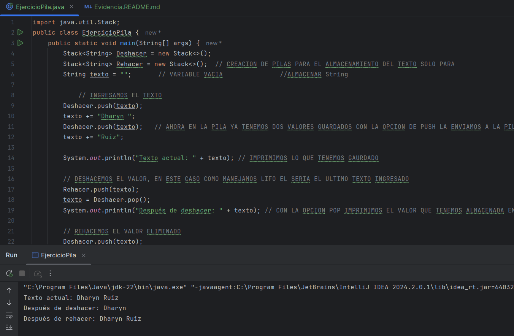
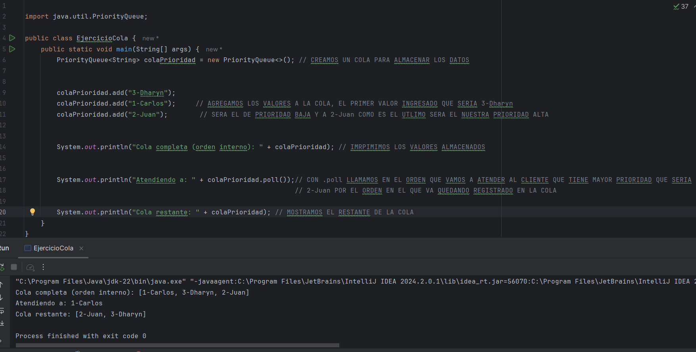
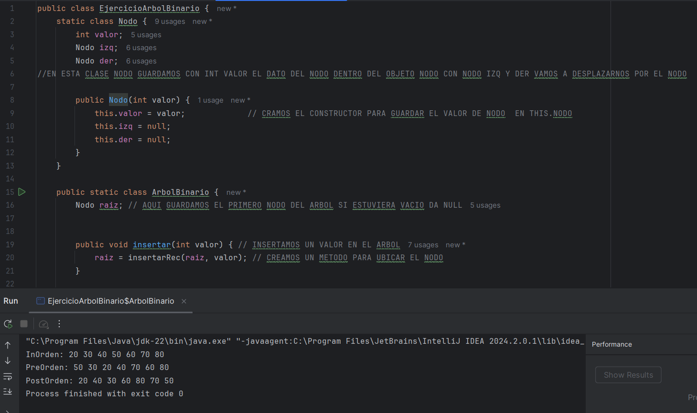
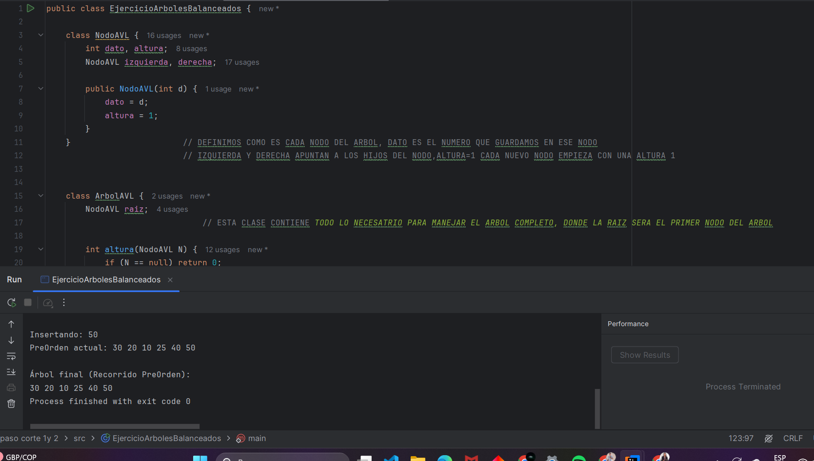
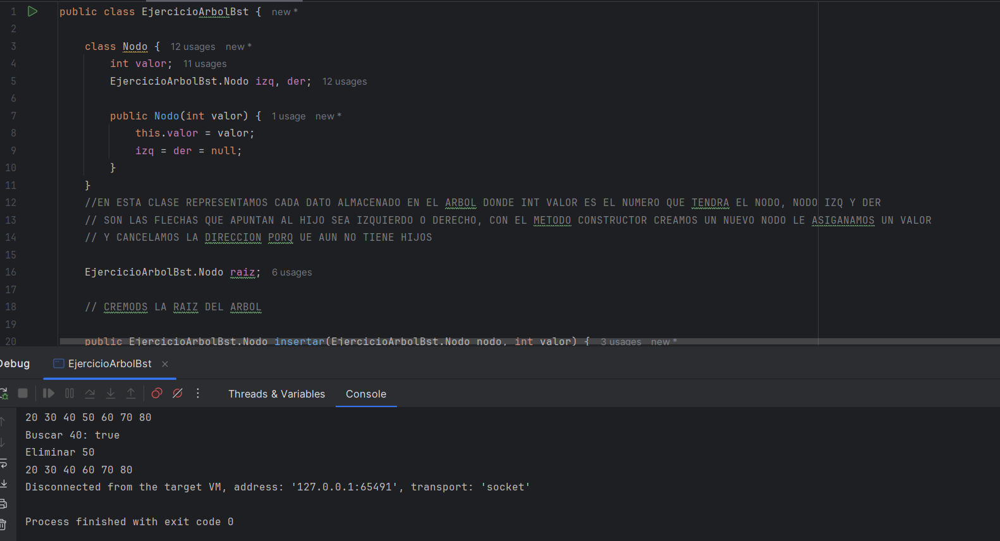

> # EJERCICIO 1- PILAS 

> # EJERCICIO 2- COLAS (QUEUE) Y VARIANTES

> # EJERCICIO 3- TABLAS HASH

> # EJERCICIO 4- ÁRBOLES BINARIOS

> # EJERCICIO 5- ÁRBOLES BALANCEADOS (AVL Y B-TREES)

> # EJERCICIO 6- ÁRBOLES BINARIOS DE BÚSQUEDA (BST)

> # EJERCICIO 7- GRAFOS

> # EJERCICIO 8- COMPLEJIDAD ALGORÍTMICA

