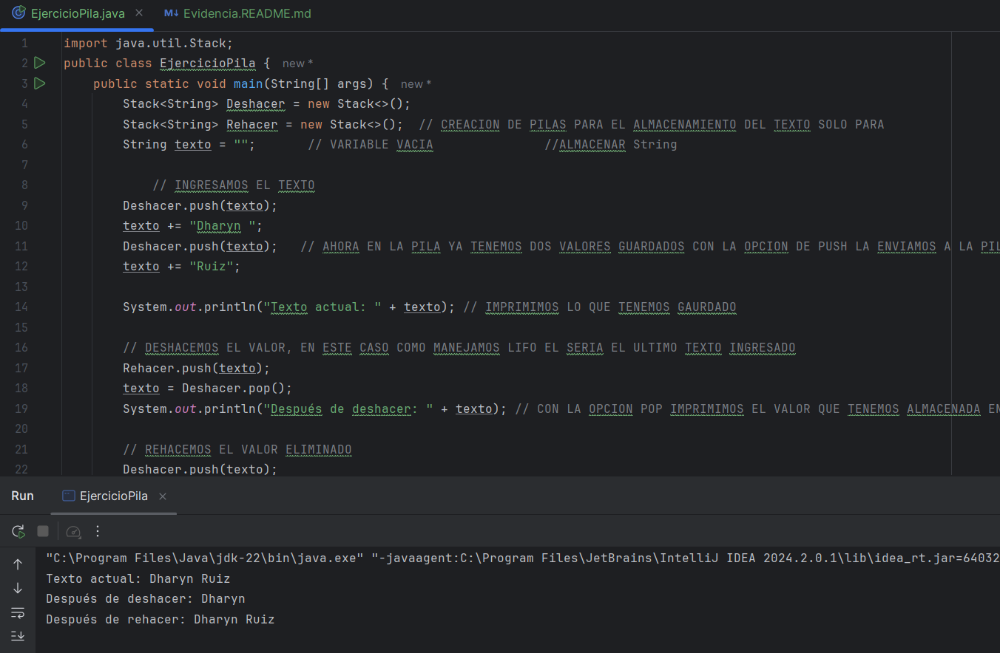
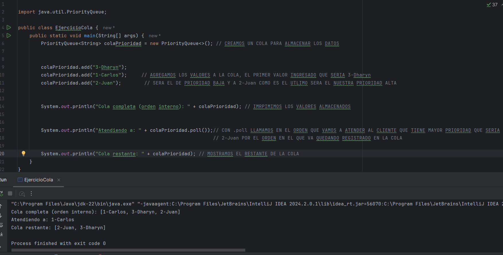
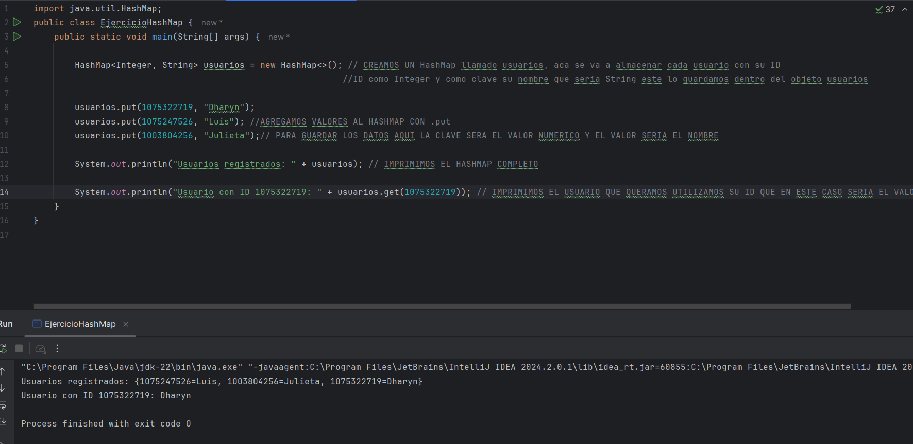
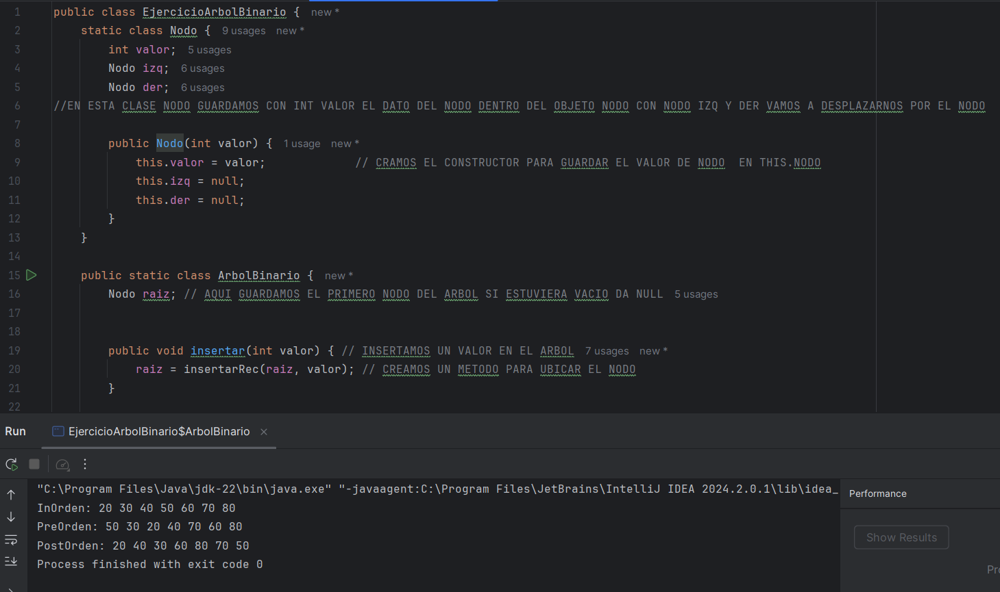
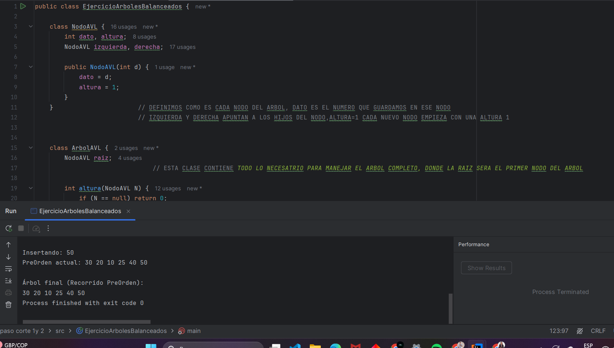
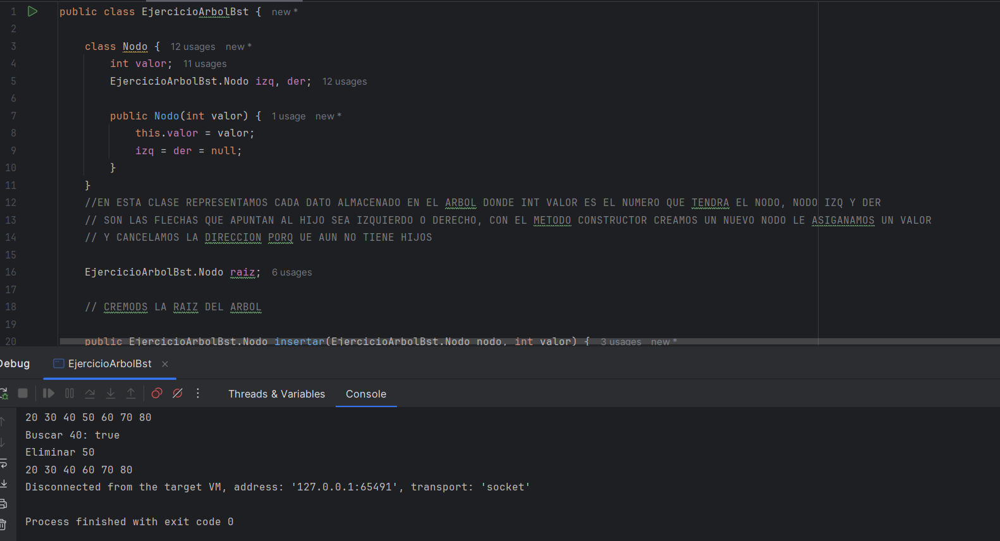
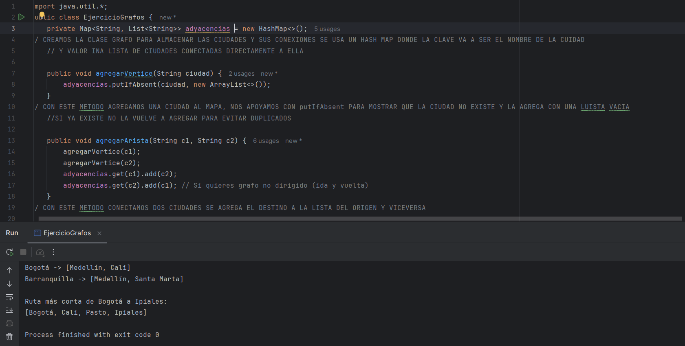

> # EJERCICIO 1- PILAS
>
Este ejercicio trata de estructuras LIFO lo usamos para deshacer/rehacer, llamades de funciones, se desarrollo  mediante la implementacion de Stack<String>
y una version mas corta con dos Stack para desahcer y rehacer, aplicamos push, pop y peek para el manejo de almacenamiento
># ANALISIS DE COMPLEJIDAD
| Operación                                                                                         | Complejidad |
| ------------------------------------------------------------------------------------------------- | ---- |
| push()                                                                                            | O(1) |
| pop()                                                                                             | O(1) |
| peek()                                                                                            | O(1) |

> # EJERCICIO 2- COLAS (QUEUE) Y VARIANTES
>
En este ejercicio implementamos estructuras FIFO, usamos PriorityQueue para las prioridades que pedian en el ejercicio, 
se aplico uso de colas con prioridad para atender por prioridad con conceptos como offer, add, poll y peek
># ANALISIS DE COMPLEJIDAD
| Operación         | Cola normal | PriorityQueue |
|-------------------| ---- | ------ |
| enqueue() (añadir) | O(1) | O(log n) |
| dequeue() (remover) | O(1) | O(log n) |
| peek()            | O(1) | O(1)   |

> # EJERCICIO 3- TABLAS HASH
>
>En este ejercicio implementamos el manejo de almacenamiento clave-valor con acceso promedio constante, esto con el fin de
agilzar las busquedas por identificador, se desarrollo cun HashMap<Interger,String> para guardar a los usuarios por ID y recuperarlos
con .get(ID), se aplico put y get para la manipulacion de los datos dentro la tabla
># ANALISIS DE COMPLEJIDAD
| Operación                                                                | Promedio | Peor caso |
| ------------------------------------------------------------------------ |------| ---- |
| put()                                                                    | O(1) | O(n) |
| get()                                                                    | O(1) | O(n) |
| remove()                                                                 | O(1) | O(n) |

> # EJERCICIO 4- ÁRBOLES BINARIOS
>
>En este ejercicio manejamos estricturas de nodos con hasta dos hijos, se desarrollo con la implementacion de una calase nodo +clase arbolbinario con metodos de insertar
y metodos de recorrido.
># ANALISIS DE COMPLEJIDAD
| Operación                                                                          | Promedio | Peor caso (árbol inclinado) |
| ---------------------------------------------------------------------------------- | ------ | --------------- |
| Insertar                                                                           | O(log n) | O(n)            |
| Buscar                                                                             | O(log n) | O(n)            |
| Recorridos (pre/in/post)                                                           | O(n)   | O(n)            |

> # EJERCICIO 5- ÁRBOLES BALANCEADOS (AVL Y B-TREES)
>
>En este ejercicio la idea era mantener el balance automaticamente en el arbol para ello implementamos calculos de altura y operaciones matematicas
para poder guiar los datos ingresados a los nodos respectivos y poder manterlo en us balance y cuando fuera necesario realziar la rotacion, se aplico
actualizacion de altiras, deteccion de desequilibrio y rotaciones
># ANALISIS DE COMPLEJIDAD
| Operación                                                            | Complejidad |
| -------------------------------------------------------------------- | ------ |
| Insertar                                                             | O(log n) |
| Buscar                                                               | O(log n) |
| Eliminar                                                             | O(log n) |
| Rotaciones                                                           | O(1)   |

> # EJERCICIO 6- ÁRBOLES BINARIOS DE BÚSQUEDA (BST)
>
>En este ejercicio procuramos utilizar las operaciones basicas de isercion busquera y eliminacion de datos, se desarrolo con nodo de insertar, buscar y eliminar como los 
3 casos, se aplicaron recursos de manejor de referencias para remplazo en eliminacion y estrategisas para conservar el orden
># ANALISIS DE COMPLEJIDAD
| Operación                                                                        | Promedio | Peor caso |
| -------------------------------------------------------------------------------- | -------- | ---- |
| Insertar                                                                         | O(log n) | O(n) |
| Buscar                                                                           | O(log n) | O(n) |
| Eliminar                                                                         | O(log n) | O(n) |

> # EJERCICIO 7- GRAFOS
>
>Este ejercicio trataba de simular un mapa para encontrar rutas entre ciudades mediantes vertices aristas, se desarrollo implementando listas adyacentes metodos para agregar vertices, aristas y rutas mas cortas
aplicamos BFS para crear colas, cuidades visitadas y mapa padre, para reconstruir la ruta mas corta en grafos no ponderado
># ANALISIS DE COMPLEJIDAD
| Operación                                                                  | Complejidad |
| -------------------------------------------------------------------------- | ----- |
| Agregar vértice/arista                                                     | O(1)  |
| BFS (ruta más corta)                                                       | O(V + E) |

> # EJERCICIO 8- COMPLEJIDAD ALGORÍTMICA
| Operación | Estructura / Caso                                | Complejidad temporal |    Complejidad espacial    |
| --------- | ------------------------------------------------ |:--------------------:| :------------------------: |
| Búsqueda  | BST balanceado (AVL, Red-Black)                  |       O(log n)       |            O(1)            |
| Búsqueda  | BST no balanceado (peor caso)                    |         O(n)         |            O(1)            |
| Inserción | HashMap (caso promedio)                          |   O(1) amortizado    |            O(1)            |
| Inserción | HashMap (peor caso – muchas colisiones o rehash) |         O(n)         | O(1) u O(n) durante rehash |
| Recorrido BFS / DFS | Grafo con lista de adyacencia                    |       O(V + E)       |            O(V)            |
| Recorrido BFS / DFS | Grafo con matriz de adyacencia                   |        O(V²)         |            O(V)            |

