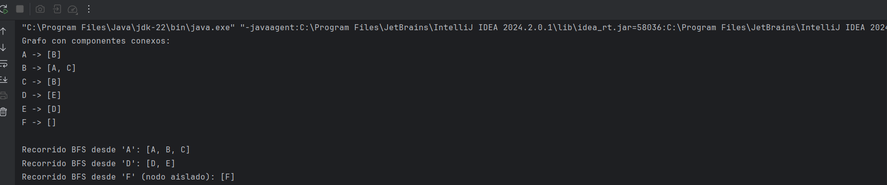
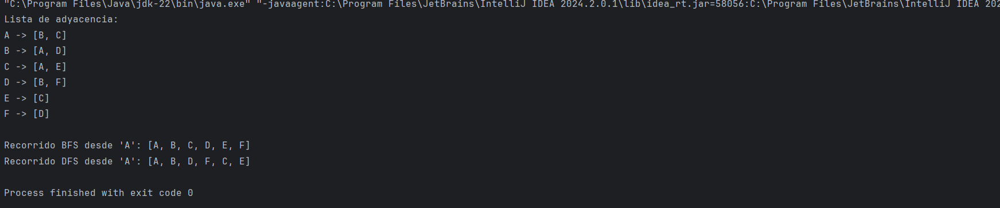

>> # Taller — Construcción de un grafo y recorrido BFS
> 
> #### GRAFO
>
> Un grafo es una estructura utilizada para representar conexiones o relaciones entre objetos
> 
> #### BFS
> 
> Es un algoritmo que se usa para realizar busquedas dentro de grafos.
> 
>PARA ESTOS EJERCICIOS SE NOS PROPORCIONO UN CODIGO BASE "GRAPH" PARA PDOER TRABAJAR CON EL 
> #### EJERCICIO 1
> 
> Para este ejercicio se pidio lo siguiente:Red social simple: modelar usuarios como nodos y amistades como aristas; recorrer
desde un usuario inicial.
> 
> 
> 
>#### EJERCICIO 2
> 
> Para este ejercicio se pidio lo siguiente:Mapa de ciudades: representar ciudades conectadas y mostrar el recorrido BFS desde
una ciudad origen.
> 
> 
> 
>  #### EJERCICIO 3
> 
> Para este ejercicio se pidio lo siguiente: Componentes conexos: probar grafos no conexos y analizar el comportamiento del
BFS.
> 
>
> 
>  #### EJERCICIO 4
> 
> Para este ejercicio se pidio lo siguiente:
> 
> Comparación con DFS: implementar DFS y comparar el orden de recorrido.
> 
> 
> 